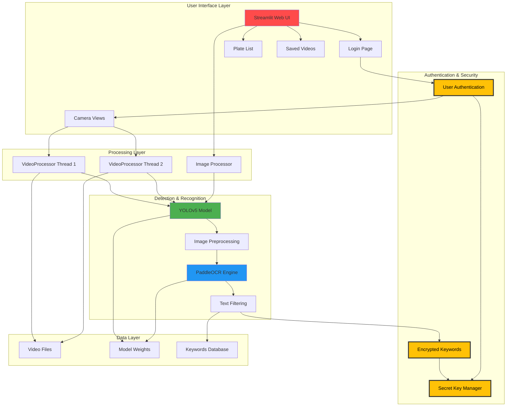
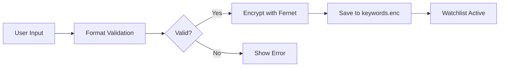

# 🚗 Turkish License Plate Recognition System

A real-time license plate recognition system designed for Turkish license plates, featuring multi-camera support, web-based interface, and keyword-based plate filtering with encrypted watchlist management.

[](https://www.python.org/downloads/)
[](https://streamlit.io)
[](https://github.com/ultralytics/yolov5)

## 📸 Screenshots

> **Note**: Add screenshots of your application here to help users understand the interface

### Login Page
- User authentication interface
- Role-based access control

### Multi-Camera Dashboard
- Live video feeds from multiple cameras
- Real-time license plate detection
- Color-coded alerts (green/red)

### Watchlist Management
- Interactive tag input for license plates
- Format validation feedback
- Encrypted storage confirmation

### Single Image Processing
- Upload interface for testing
- Detection results with bounding boxes
- Response time metrics

## 🌟 Features

- **Real-time License Plate Detection**: YOLOv5-based detection with high accuracy
- **Turkish Plate Format Recognition**: Optimized for Turkish license plate format (e.g., 34ABC123)
- **Multi-Camera Support**: Process multiple video streams simultaneously
- **Encrypted Watchlist System**: Manage and monitor specific license plates with encryption
- **Visual Alerts**: Color-coded detection (green for watchlist matches, red for unknown plates)
- **Web-Based Interface**: Built with Streamlit for easy deployment and access
- **Role-Based Authentication**: Secure login with admin, editor, and viewer roles
- **Image Upload Support**: Process individual images for testing
- **Real-time Video Processing**: Background thread processing with adjustable FPS

## 🛠️ Technology Stack

### Core Technologies
- **Python 3.8+**: Primary programming language
- **PyTorch**: Deep learning framework for YOLOv5
- **YOLOv5**: Object detection for license plate localization
- **PaddleOCR**: Optical character recognition engine
- **OpenCV**: Computer vision and image processing
- **NumPy**: Numerical computing

### Web Framework
- **Streamlit**: Web application framework
- **Streamlit-Authenticator**: User authentication
- **Streamlit-Tags**: Tag input component for watchlist

### Security & Data
- **Cryptography (Fernet)**: Symmetric encryption for watchlist
- **PyYAML**: Configuration management
- **Pickle**: Data serialization

### Development Tools
- **Git**: Version control
- **Threading**: Concurrent video processing
- **Regular Expressions**: Plate format validation

## 🏗️ Architecture



## 🔧 System Components

### Core Modules

#### 1. **model_utils.py**
Core detection and recognition engine:
- `YOLO_MODEL`: YOLOv5 wrapper for license plate detection
- `VideoProcessor`: Multi-threaded video processing with singleton pattern
- `recognize_plate_ocr()`: PaddleOCR-based text recognition
- `filter_text()`: Turkish plate format validation (regex-based)
- `clean()`: Image preprocessing (resize, enhance, grayscale, morphology)
- `draw_label()`: Visual annotation with watchlist matching

#### 2. **streamlit_app.py**
Main multi-camera application:
- Dual video stream processing
- Session-based authentication
- Page navigation system
- Persistent video processor instances

#### 3. **ui.py**
Standalone image processing interface for testing and demonstration

#### 4. **base/** (Authentication & Security Module)
- **auth.py**: Streamlit-authenticator wrapper
- **auth_config.yaml**: User credentials and role configuration
- **key.py**: Fernet encryption/decryption for watchlist management
  - `create_key()`: Generate encryption key
  - `encrypt_and_save()`: Secure data storage
  - `decrypt_and_load()`: Secure data retrieval

#### 5. **tabs/** (Application Pages)
- **plates.py**: Interactive watchlist management
  - Add/remove license plates
  - Format validation
  - Encrypted storage
  - Real-time feedback
- **saved_videos.py**: Video archive interface (placeholder for future development)

## 🚀 Installation

### Quick Start

```bash
# Clone the repository
git clone https://github.com/baloglu321/plate_rec.git
cd plate_rec

# Install dependencies
pip install -r requirements.txt

# Download YOLOv5
git clone https://github.com/ultralytics/yolov5.git

# Get the model weights
# Download yolo.pt from: https://github.com/KALYAN1045/Automatic-Number-Plate-Recognition-using-YOLOv5
# Place it in the root directory

# Add your test videos
# Place video.mp4 and video-2.mp4 in root directory

# Run the application
streamlit run streamlit_app.py

# Login with default credentials:
# Username: jsmith
# Password: abc
```

### Prerequisites

- Python 3.8 or higher
- CUDA-capable GPU (recommended for real-time processing)
- Webcam or video files

### Step 1: Clone the Repository

```bash
git clone https://github.com/baloglu321/plate_rec.git
cd plate_rec
```

### Step 2: Install Dependencies

```bash
pip install -r requirements.txt
```

### Step 3: Download YOLOv5

The project uses a local YOLOv5 installation:

```bash
# YOLOv5 should be in ./yolov5 directory
# If not present, clone it:
git clone https://github.com/ultralytics/yolov5.git
```

### Step 4: Prepare Model Weights

This project uses a YOLOv5 model trained for license plate detection. The model (`yolo.pt`) is based on the work from:

**Model Source**: [KALYAN1045/Automatic-Number-Plate-Recognition-using-YOLOv5](https://github.com/KALYAN1045/Automatic-Number-Plate-Recognition-using-YOLOv5)

**Options:**

1. **Use the pre-trained model** from the source repository above
2. **Train your own model** on Turkish license plate datasets for better accuracy

Place the model file as `yolo.pt` in the project root directory.

**Training your own model (recommended for production):**
```bash
# Prepare your dataset in YOLO format
# Use YOLOv5 training script
cd yolov5
python train.py --data custom_plate_data.yaml --weights yolov5s.pt --epochs 100
```

### Step 5: Setup Video Files

Place your video files in the root directory:
- `video.mp4` - Camera 1
- `video-2.mp4` - Camera 2

Or modify the paths in `streamlit_app.py`.

## 📖 Usage

### Initial Setup

#### 1. Configure Authentication

The system uses YAML-based authentication. Default credentials are provided in `base/auth_config.yaml`:

**Default Login:**
- **Username**: `jsmith`
- **Password**: `abc`
- **Role**: Admin (full access)

> ⚠️ **Important**: Change these credentials before production deployment!

To add new users or modify credentials, edit `base/auth_config.yaml`:

```yaml
credentials:
  usernames:
    your_username:
      email: your_email@example.com
      first_name: Your
      last_name: Name
      password: your_password  # Will be hashed automatically
      roles:
        - admin  # or editor, viewer
```

#### 2. Setup Watchlist (Optional)

The system includes an encrypted watchlist feature. To add license plates to monitor:

1. Login to the application
2. Navigate to "Plaka listesi" (Plate List) page
3. Enter license plates in Turkish format (e.g., `34ABC1234`)
4. Plates are automatically encrypted and saved

### Running the Main Application

```bash
streamlit run streamlit_app.py
```

The application will start at `http://localhost:8501`

### Running the Simple Image Processor

```bash
streamlit run ui.py
```

### Application Pages

The main application includes several pages:

- **Yayınlar (Broadcasts)**: Live camera feeds with real-time plate detection
  - Camera 1: First video stream
  - Camera 2: Second video stream
- **Plaka listesi (Plate List)**: Manage your watchlist of license plates
- **Kayıtlı videolar (Saved Videos)**: Access recorded footage
- **Çıkış Yap (Logout)**: End your session

## 🎯 How It Works

### 1. License Plate Detection Flow

```mermaid
flowchart LR
    A[Video Stream] --> B[VideoProcessor]
    B --> C[YOLOv5 Detection]
    C --> D[Crop Plate]
    D --> E[Preprocess Image]
    E --> F[PaddleOCR]
    F --> G[Validate Format]
    G --> H[Check Watchlist]
    H --> I[Draw Label]
    I --> J[Display Result]
    
    style C fill:#4CAF50,stroke:#333,stroke-width:3px,color:#000
    style F fill:#2196F3,stroke:#333,stroke-width:3px,color:#000
    style H fill:#FFC107,stroke:#333,stroke-width:3px,color:#000
    style J fill:#FF4B4B,stroke:#333,stroke-width:3px,color:#000
```



### 2. Turkish Plate Format

The system recognizes plates matching the pattern:
- Format: `[2 digits][1-3 letters][2-5 digits]`
- Example: `34ABC1234`, `06XYZ999`

Regex pattern used: `^[0-9]{2}[A-Z]{1,3}[0-9]{2,5}$`

### 3. Watchlist Matching System

The system uses an encrypted watchlist for monitoring specific plates:

**Storage Flow:**


**Detection Flow:**
- Detected plates are compared against the encrypted watchlist
- **Green highlight**: Plate matches watchlist (potential vehicle of interest)
- **Red highlight**: Plate not in watchlist (unknown vehicle)
- All comparisons happen after decryption in memory

**File Structure:**
- `keywords.enc`: Encrypted binary file containing watchlist
- `secret.key`: Fernet encryption key (auto-generated, keep secure!)
- Format: Pickled Python list encrypted with Fernet

## 🎨 Features in Detail

### Multi-Camera Processing

The system uses a singleton pattern to manage video processors efficiently:

```python
# Each processor runs in its own thread
processor_1 = VideoProcessor.get_instance("processor_1", "./video.mp4", fps=20.0)
processor_2 = VideoProcessor.get_instance("processor_2", "./video-2.mp4", fps=15.0)

# Processors persist across page navigation
# Frames are processed continuously in background threads
```

**Key Benefits:**
- No redundant model loading
- Smooth video streaming
- Independent FPS control per camera
- Memory efficient

### Watchlist Management Interface

The **Plaka listesi** (Plate List) page provides an interactive interface for managing monitored plates:

**Features:**
- **Tag-based input**: Add plates with autocomplete suggestions
- **Real-time validation**: Instant feedback on plate format
- **Format enforcement**: Only accepts valid Turkish plates (e.g., `34ABC1234`)
- **Automatic encryption**: Plates are encrypted immediately upon saving
- **Visual feedback**: 
  - ✅ Valid plates shown in tags
  - ❌ Invalid entries highlighted with error message
- **Persistent storage**: Watchlist survives application restarts

**Validation Rules:**
```regex
^[0-9]{2}[A-Z]{1,3}[0-9]{2,5}$
```
- 2 digits (city code)
- 1-3 uppercase letters
- 2-5 digits

**Examples:**
- ✅ Valid: `34ABC123`, `06XY9999`, `01A12345`
- ❌ Invalid: `345ABC123`, `34abc123`, `AA1234`

### Image Enhancement Pipeline

```python
# Preprocessing steps:
1. Resize (1.2x scale)
2. Detail enhancement
3. Grayscale conversion
4. Morphological operations (dilation + erosion)
```

### Performance Optimization

- **Background Threading**: Video processing runs in separate threads
- **Frame Rate Control**: Adjustable FPS for each camera
- **GPU Acceleration**: CUDA support for YOLOv5
- **Singleton Pattern**: VideoProcessor instances are reused

## 📁 Project Structure

```
plate_rec/
├── streamlit_app.py         # Main multi-camera application (entry point)
├── ui.py                    # Single image upload interface
├── model_utils.py           # Core detection & recognition logic
├── plate_rec_ui.py          # (Legacy/Empty file)
├── yolo.pt                  # YOLOv5 model weights (not included in repo)
├── video.mp4                # Sample video 1 (not included in repo)
├── video-2.mp4              # Sample video 2 (not included in repo)
├── keywords.enc             # Encrypted watchlist database
├── secret.key               # Fernet encryption key (auto-generated)
├── requirements.txt         # Python dependencies
├── LICENSE                  # Apache 2.0 License
├── README.md                # This file
├── base/                    # Authentication & security
│   ├── auth.py              # Authentication wrapper
│   ├── auth_config.yaml     # User credentials & roles
│   └── key.py               # Encryption utilities
├── tabs/                    # Streamlit page modules
│   ├── plates.py            # Watchlist management interface
│   └── saved_videos.py      # Video archive (placeholder)
├── yolov5/                  # YOLOv5 framework (git submodule)
└── backup/                  # Backup files (if any)
```

**Note**: Files marked "not included in repo" should be added by the user during setup.

## 🔐 Security Features

### 1. Multi-Role Authentication
- **Admin**: Full system access (add/edit watchlist, view all cameras)
- **Editor**: Can modify watchlist
- **Viewer**: Read-only access
- Managed via `base/auth_config.yaml`

### 2. Encrypted Watchlist Storage
- License plates stored using **Fernet symmetric encryption**
- Automatic key generation on first run (`secret.key`)
- Keys stored as encrypted binary files (`keywords.enc`)
- No plaintext storage of sensitive plate numbers

### 3. Session Management
- Cookie-based session handling
- Configurable session timeout (default: ~26 seconds for testing)
- Automatic logout functionality

### 4. Input Validation
- Turkish plate format enforcement: `^[0-9]{2}[A-Z]{1,3}[0-9]{2,5}$`
- Regex validation prevents injection attacks
- Real-time feedback on invalid entries


## ❓ Frequently Asked Questions

### Q: Can I use this with live camera streams?
**A:** Yes! Replace the video file paths with RTSP URLs or webcam indices:
```python
# In streamlit_app.py
processor_1 = VideoProcessor.get_instance("processor_1", 0, fps=20.0)  # Webcam
processor_2 = VideoProcessor.get_instance("processor_2", "rtsp://...", fps=15.0)  # IP Camera
```

### Q: How accurate is the Turkish plate recognition?
**A:** Accuracy depends on:
- Image quality and lighting conditions
- YOLOv5 model training data
- Distance and angle of the plate
- Typical accuracy: 85-95% with good conditions

### Q: Can I add more than 2 cameras?
**A:** Yes! Add more VideoProcessor instances in `streamlit_app.py`:
```python
st.session_state.processor_3 = VideoProcessor.get_instance("processor_3", "./video-3.mp4")
```

### Q: How do I change the session timeout?
**A:** Edit `base/auth_config.yaml`:
```yaml
cookie:
  expiry_days: 1  # 1 day instead of 0.0003 (~26 seconds)
```

### Q: Is the watchlist limited in size?
**A:** The `plates.py` interface has a soft limit of 40 plates (`maxtags=40`), but this can be increased by modifying line 43 in `tabs/plates.py`.

### Q: Can I use non-Turkish plate formats?
**A:** Yes! Modify the regex pattern in:
- `model_utils.py` line 113 (filter_text function)
- `tabs/plates.py` line 14 (validation function)

## 🔧 Configuration

### Adjusting Detection Threshold

```python
# In model_utils.py, line 321
yolo_detections = model(img, conf_threshold=0.55)  # Increase for fewer false positives
```

### Changing Video Sources

```python
# In streamlit_app.py, lines 7-10
processor_1 = VideoProcessor.get_instance("processor_1", "./your_video.mp4", fps=30.0)
```

### OCR Language Configuration

```python
# In model_utils.py or ui.py
ocr = PaddleOCR(lang='en')  # Options: 'en', 'tr', 'ch', etc.
# Note: 'en' works well for Turkish plates as they use Latin alphabet
```

### Adjusting Frame Rate

```python
# In streamlit_app.py
fps=20.0  # Lower FPS = less CPU usage, higher FPS = smoother but more demanding
```

## 📊 Performance Metrics

The system tracks various performance metrics:
- Model inference time
- OCR processing time
- Image preprocessing time
- Total response time

These can be logged for monitoring and optimization.

## 📊 Performance Metrics

The system tracks various performance metrics for monitoring and optimization:

### Timing Breakdown
- **Model Inference**: ~50-100ms per frame (GPU) / ~200-500ms (CPU)
- **Image Preprocessing**: ~10-20ms per plate
- **OCR Processing**: ~100-200ms per plate
- **Text Filtering**: ~1-5ms per plate
- **Label Drawing**: ~5-10ms per plate

### Typical Performance
- **Single Image**: ~300-500ms total (GPU)
- **Video Stream**: 15-30 FPS (depending on camera count and hardware)
- **Accuracy**: 85-95% (with optimal conditions)

### Hardware Requirements

**Minimum:**
- CPU: Intel i5 / AMD Ryzen 5
- RAM: 8GB
- Storage: 5GB free space
- GPU: Optional but recommended

**Recommended:**
- CPU: Intel i7 / AMD Ryzen 7
- RAM: 16GB
- Storage: 10GB free space
- GPU: NVIDIA GPU with 4GB+ VRAM (CUDA support)

### Optimization Tips

1. **GPU Usage**: Ensure PyTorch detects CUDA
```python
import torch
print(torch.cuda.is_available())  # Should return True
```

2. **Reduce Image Resolution**: Lower FPS for less powerful machines
```python
# In streamlit_app.py
fps=15.0  # Instead of 30.0
```

3. **Process Fewer Cameras**: Start with one camera to test performance

4. **Batch Processing**: For offline processing, process frames in batches

## 🐛 Troubleshooting

### Common Issues

#### 1. **Authentication Errors**
```bash
# Error: "Username/password is incorrect"
# Solution: Check credentials in base/auth_config.yaml
# Default: username=jsmith, password=abc
```

#### 2. **Module Not Found: base.key or base.auth**
```bash
# Error: ModuleNotFoundError: No module named 'base'
# Solution: Ensure you're running from project root directory
cd plate_rec
streamlit run streamlit_app.py
```

#### 3. **CUDA Out of Memory**
```python
# Solution: Reduce image size in model_utils.py
img = cv2.resize(img, (640, 360))  # Smaller resolution
# Or use CPU only:
# In YOLO_MODEL.__init__, remove: self.model.cuda()
```

#### 4. **PaddleOCR Initialization Errors**
```bash
# Reinstall PaddleOCR
pip uninstall paddleocr paddlepaddle
pip install paddleocr
```

#### 5. **Video Not Loading**
- Verify video files exist: `video.mp4` and `video-2.mp4`
- Check file paths in `streamlit_app.py` lines 7-10
- Ensure videos are in MP4 format
- Try with smaller resolution videos first

#### 6. **Encryption Key Issues**
```bash
# Error: "Invalid token" or encryption errors
# Solution: Delete and regenerate keys
rm secret.key keywords.enc
# Keys will be auto-generated on next run
```

#### 7. **YOLOv5 Loading Errors**
```bash
# Error: "No module named 'models'"
# Solution: Ensure yolov5 directory exists
git clone https://github.com/ultralytics/yolov5.git
# Or check path in model_utils.py line 249
```

#### 8. **Streamlit Port Already in Use**
```bash
# Solution: Use different port
streamlit run streamlit_app.py --server.port 8502
```

## 🚀 Deployment

### Local Development
```bash
streamlit run streamlit_app.py
```

### Production Deployment Options

#### Option 1: Streamlit Cloud (Easiest)
1. Push code to GitHub
2. Connect repository to [Streamlit Cloud](https://streamlit.io/cloud)
3. Add secrets for `auth_config.yaml`
4. Deploy with one click

**Note**: Large model files may require alternative storage (S3, Google Drive)

#### Option 2: Docker Container
```dockerfile
FROM python:3.9-slim

WORKDIR /app
COPY requirements.txt .
RUN pip install -r requirements.txt

COPY . .

EXPOSE 8501
CMD ["streamlit", "run", "streamlit_app.py", "--server.port=8501", "--server.address=0.0.0.0"]
```

```bash
# Build and run
docker build -t plate-recognition .
docker run -p 8501:8501 plate-recognition
```

#### Option 3: Linux Server (VPS/Dedicated)
```bash
# Install dependencies
sudo apt update
sudo apt install python3-pip python3-venv

# Create virtual environment
python3 -m venv venv
source venv/bin/activate

# Install packages
pip install -r requirements.txt

# Run with nohup
nohup streamlit run streamlit_app.py --server.port 8501 &

# Or use systemd service
sudo nano /etc/systemd/system/plate-rec.service
```

**Systemd Service File:**
```ini
[Unit]
Description=License Plate Recognition System
After=network.target

[Service]
Type=simple
User=your-user
WorkingDirectory=/path/to/plate_rec
ExecStart=/path/to/venv/bin/streamlit run streamlit_app.py
Restart=always

[Install]
WantedBy=multi-user.target
```

### Security Considerations for Production

1. **Change Default Credentials**: Update `base/auth_config.yaml`
2. **Use HTTPS**: Configure reverse proxy (Nginx/Apache)
3. **Set Strong Cookie Key**: Modify `auth_config.yaml` cookie key
4. **Increase Session Timeout**: Change `expiry_days` from 0.0003 to reasonable value
5. **Secure secret.key**: Ensure proper file permissions (600)
6. **Environment Variables**: Store sensitive data in env vars instead of config files
7. **Firewall Rules**: Limit access to specific IPs if needed
8. **Regular Backups**: Backup `keywords.enc` and `auth_config.yaml`

### Performance Optimization

**For Production:**
- Use GPU-enabled server for faster inference
- Implement Redis caching for frequent queries
- Use load balancer for multiple camera streams
- Optimize video resolution based on bandwidth
- Enable Streamlit caching decorators

**Nginx Reverse Proxy Example:**
```nginx
server {
    listen 80;
    server_name your-domain.com;

    location / {
        proxy_pass http://localhost:8501;
        proxy_http_version 1.1;
        proxy_set_header Upgrade $http_upgrade;
        proxy_set_header Connection "upgrade";
        proxy_set_header Host $host;
    }
}
```


### What This Means

✅ **You Can:**
- Use commercially
- Modify and distribute
- Use privately
- Use patent claims from contributors

⚠️ **You Must:**
- Include license and copyright notice
- State significant changes made
- Include NOTICE file if provided

❌ **You Cannot:**
- Hold the author liable
- Use trademarks without permission

### Third-Party Licenses

This project uses several open-source components:
- **YOLOv5**: GPL-3.0 License
- **PaddleOCR**: Apache License 2.0
- **Streamlit**: Apache License 2.0

Please review their respective licenses for compliance.

## ⚖️ Disclaimer

**Important Legal & Ethical Considerations:**

1. **Privacy Laws**: Ensure compliance with local privacy and data protection laws (GDPR, KVKK in Turkey)
2. **Surveillance Regulations**: Obtain necessary permissions for video surveillance
3. **Data Storage**: Implement proper data retention policies
4. **Informed Consent**: Inform individuals about surveillance where required
5. **Purpose Limitation**: Use only for legitimate, lawful purposes

**This software is provided "as is" without warranty of any kind. The authors are not responsible for:**
- Misuse of the software
- Legal consequences of improper deployment
- Accuracy of license plate recognition
- Privacy violations due to improper use

**Recommended Use Cases:**
- ✅ Private property security (with proper signage)
- ✅ Parking management systems
- ✅ Research and development
- ✅ Educational purposes

**Not Recommended For:**
- ❌ Mass surveillance without legal authority
- ❌ Tracking individuals without consent
- ❌ Law enforcement without proper authorization

## 🤝 Contributing

Contributions are welcome! Here's how you can help improve this project:

### Ways to Contribute

1. **Report Bugs**: Open an issue with detailed description
2. **Suggest Features**: Share your ideas for improvements
3. **Improve Documentation**: Fix typos, add examples, clarify instructions
4. **Submit Code**: Fix bugs or implement new features
5. **Share Datasets**: Help improve model accuracy with Turkish plate datasets

### Contribution Workflow

1. **Fork the repository**
```bash
git clone https://github.com/your-username/plate_rec.git
cd plate_rec
```

2. **Create a feature branch**
```bash
git checkout -b feature/AmazingFeature
```

3. **Make your changes**
- Follow existing code style
- Add comments for complex logic
- Update documentation if needed

4. **Test your changes**
```bash
# Run the application
streamlit run streamlit_app.py

# Test with different scenarios
# - Various lighting conditions
# - Different plate formats
# - Multiple camera angles
```

5. **Commit your changes**
```bash
git add .
git commit -m 'Add: Amazing new feature'
```

Use conventional commit messages:
- `Add:` for new features
- `Fix:` for bug fixes
- `Update:` for improvements
- `Docs:` for documentation
- `Refactor:` for code refactoring


7. **Open a Pull Request**
- Provide clear description of changes
- Reference any related issues
- Include screenshots if UI changes

### Code Style Guidelines

- Use Python PEP 8 style guide
- Add docstrings to functions
- Keep functions focused and concise
- Use meaningful variable names
- Comment complex algorithms


### Testing

Before submitting, ensure:
- ✅ Application starts without errors
- ✅ Login works with test credentials
- ✅ Video streams display correctly
- ✅ Plate detection works on sample images
- ✅ Watchlist add/remove functions properly
- ✅ No new warnings or errors in console

## 👨‍💻 Author

**Mehmet Baloglu**

- GitHub: [@baloglu321](https://github.com/baloglu321)
- Project Link: [https://github.com/baloglu321/plate_rec](https://github.com/baloglu321/plate_rec)

## 📧 Support & Community

### Getting Help

1. **Check Documentation**: Review this README thoroughly
2. **Search Issues**: Look for existing solutions in [GitHub Issues](https://github.com/baloglu321/plate_rec/issues)
3. **Ask Questions**: Open a new issue with the `question` label
4. **Report Bugs**: Open an issue with the `bug` label

### Issue Template

When reporting bugs, include:
```markdown
**Environment:**
- OS: [e.g., Ubuntu 22.04]
- Python Version: [e.g., 3.9.7]
- GPU: [e.g., NVIDIA RTX 3060]

**Description:**
Clear description of the issue

**Steps to Reproduce:**
1. Step one
2. Step two
3. ...

**Expected vs Actual Behavior:**
What should happen vs what actually happens

**Screenshots/Logs:**
If applicable

**Additional Context:**
Any other relevant information
```

### Community Guidelines

- Be respectful and constructive
- Help others when you can
- Share your use cases and improvements
- Give credit where credit is due

## 📊 Project Stats

- **Language**: Python
- **Framework**: Streamlit
- **License**: Apache 2.0
- **Status**: Active Development

## 🗺️ Roadmap

### Version 1.0 (Current)
- ✅ Multi-camera support
- ✅ Turkish plate recognition
- ✅ Encrypted watchlist
- ✅ Authentication system


## 🙏 Acknowledgments

- [YOLOv5](https://github.com/ultralytics/yolov5) by Ultralytics - Object detection framework
- [KALYAN1045/Automatic-Number-Plate-Recognition](https://github.com/KALYAN1045/Automatic-Number-Plate-Recognition-using-YOLOv5) - Pre-trained license plate detection model
- [PaddleOCR](https://github.com/PaddlePaddle/PaddleOCR) by PaddlePaddle - OCR engine
- [Streamlit](https://streamlit.io/) - Web application framework
- [Streamlit-Authenticator](https://github.com/mkhorasani/Streamlit-Authenticator) - Authentication component
- [OpenCV](https://opencv.org/) - Computer vision library
- [Cryptography](https://cryptography.io/) - Encryption library for secure watchlist storage

---

<div align="center">

## 🌟 Star History

[](https://star-history.com/#baloglu321/plate_rec&Date)

## 📈 Project Statistics


---

### ⭐ If you find this project useful, please consider giving it a star!

### 🔄 Stay Updated
Watch this repository to get notified about new releases and updates

### 🤝 Connect & Collaborate
Open to collaborations and improvements - let's build something great together!

---

**Made with ❤️ by [Mehmet Baloglu](https://github.com/baloglu321)**

*Turkish License Plate Recognition System - Real-time detection with encrypted watchlist management*

</div>
